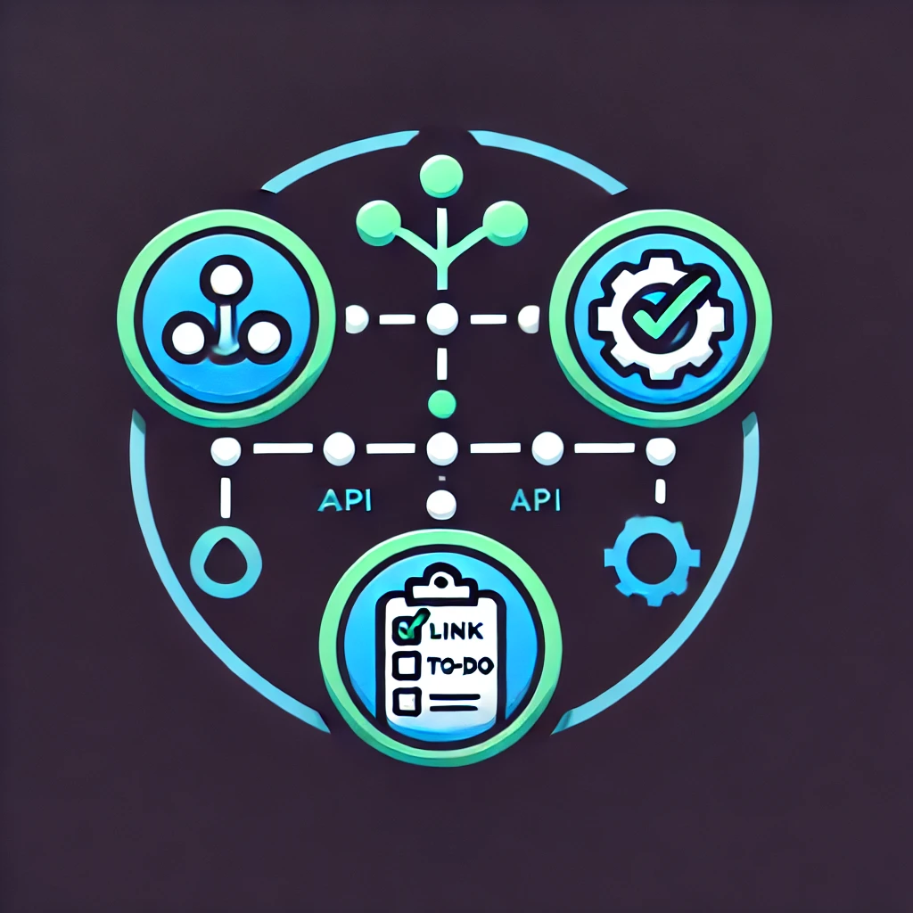

# luka-lta-backend

[![Contributors][contributors-shield]][contributors-url]
[![Forks][forks-shield]][forks-url]
[![Stargazers][stars-shield]][stars-url]
[![Issues][issues-shield]][issues-url]
[![License][license-shield]][license-url]
[![LinkedIn][linkedin-shield]][linkedin-url]

<!-- PROJECT LOGO -->
<br />
<div align="center">
  <a href="https://github.com/luka-lta/luka-lta-backend">
    
  </a>

<h3 align="center">luka-lta-backend</h3>

  <p align="center">
    Backend for managing links and clicks in my system.
    <br />
    <a href="https://github.com/luka-lta/luka-lta-backend"><strong>Explore the docs »</strong></a>
    <br />
    <br />
    <a href="https://backend.luka-lta.dev/">View Demo</a>
    &middot;
    <a href="https://github.com/luka-lta/luka-lta-backend/issues/new?labels=bug&template=bug-report---.md">Report Bug</a>
    &middot;
    <a href="https://github.com/luka-lta/luka-lta-backend/issues/new?labels=enhancement&template=feature-request---.md">Request Feature</a>
  </p>
</div>

---

## About The Project

This backend API is built with PHP and the Slim framework. It manages link collections, tracks click events, and supports API key authentication for secure access.

### Built With

- ![VITE][vite]

## Getting Started

### Prerequisites

Ensure you have the following installed:

- Node.js

### Installation

1. Clone the repository:
   ```bash
   git clone https://github.com/luka-lta/luka-lta-backend.git
   cd luka-lta-backend
   ```

2. Install dependencies using npm:
   ```bash
   npm install
   ```

3. Start the application using npm:
   ```bash
   npm run dev
   ```

## Features

- User Management
- Link Management
- Click Tracking
- API Key Authentication
- Permissions
- Tools

---

## Roadmap

See the [open issues](https://github.com/luka-lta/luka-lta-backend/issues) for a list of proposed features and known issues.

---

## Contributing

Contributions are what make the open-source community amazing! Any contributions you make are **greatly appreciated**.

1. Fork the project
2. Create your feature branch (`git checkout -b feature/AmazingFeature`)
3. Commit your changes (`git commit -m 'Add some AmazingFeature'`)
4. Push to the branch (`git push origin feature/AmazingFeature`)
5. Open a pull request

### Top Contributors

<a href="https://github.com/luka-lta/luka-lta-backend/graphs/contributors">
  
</a>

---

## License

Distributed under the MIT License. See `LICENSE.txt` for more information.

---

## Contact

**luka-lta** – [info@luka-lta.dev](mailto:info@luka-lta.dev)

Project Link: [https://github.com/luka-lta/luka-lta-backend](https://github.com/luka-lta/luka-lta-backend/)

---

## Acknowledgments

- [Vite](https://vite.dev/)

---

[contributors-shield]: https://img.shields.io/github/contributors/luka-lta/luka-lta-backend.svg?style=for-the-badge
[contributors-url]: https://github.com/luka-lta/luka-lta-backend/graphs/contributors
[forks-shield]: https://img.shields.io/github/forks/luka-lta/luka-lta-backend.svg?style=for-the-badge
[forks-url]: https://github.com/luka-lta/luka-lta-backend/network/members
[stars-shield]: https://img.shields.io/github/stars/luka-lta/luka-lta-backend.svg?style=for-the-badge
[stars-url]: https://github.com/luka-lta/luka-lta-backend/stargazers
[issues-shield]: https://img.shields.io/github/issues/luka-lta/luka-lta-backend.svg?style=for-the-badge
[issues-url]: https://github.com/luka-lta/luka-lta-backend/issues
[license-shield]: https://img.shields.io/github/license/luka-lta/luka-lta-backend.svg?style=for-the-badge
[license-url]: https://github.com/luka-lta/luka-lta-backend/blob/master/LICENSE.txt
[linkedin-shield]: https://img.shields.io/badge/-LinkedIn-black.svg?style=for-the-badge&logo=linkedin&colorB=555
[linkedin-url]: https://linkedin.com/in/linkedin_username
[vite]: https://img.shields.io/badge/Vite-646CFF?style=for-the-badge&logo=Vite&logoColor=white

